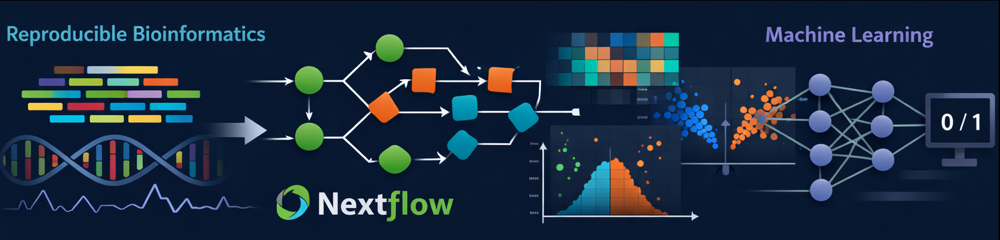

  

## Hi there 👋

I am a Bioinformatician working at the intersection of:
- Transcriptomics & genomics
- Machine learning for using big datasets like patients metadata
- Biological math modeling

## 🧬 Research Interests
- Antimicrobial resistance
- Peptide and protein engineering
- Systems biology and FBA/dFBA
- Multi-omics integration

## 🛠️ Tech Stack
- Languages: Python, R, Bash
- Bioinformatics: Nextflow, DESeq2, edgeR, Kleborate
- ML: scikit-learn, XGBoost
- HPC: SLURM, Linux, SSH

## Links

https://www.kaggle.com/jeremyguerreroalejos  
https://huggingface.co/halion1
